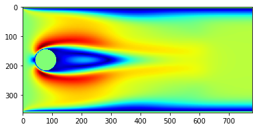
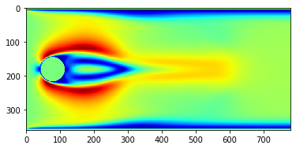
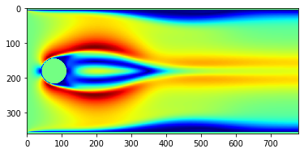
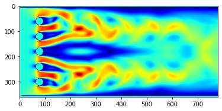

# Etude de l'écoulement
Utilisation d'un modèle numérique simplifié basée sur "Lattice Boltzmann Method" (LBM) en configuration D2Q9 pour modéliser l'écoulement 2D tout d'abord autour d'un cylindre de section circulaire puis à travers une grille simulée par 5 cylindres et dans tous les cas pour des Reynolds de compris entre 50 et de 200.

Programmation de la simulation en Python, représentation de l'écoulement, et interprétation des résultats dans les 4 cas évoqués ci-dessus.

Les images ci-dessous illustrent les résultats de cette simulations :

Ecoulement autour d'un cylindre pour 50 Reynolds :

Ecoulement autour d'un cylindre pour 100 Reynolds :

Ecoulement autour d'un cylindre pour 150 Reynolds :

Ecoulement autour de 5 cylindres pour 50 Reynolds :

